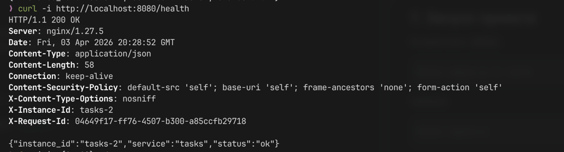
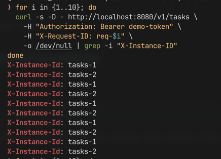
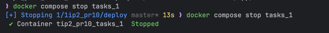
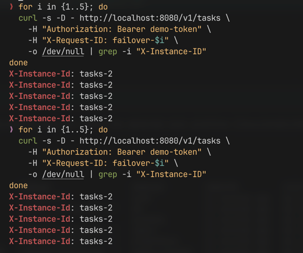

# Практическое занятие №10

## Рузин Иван Александрович ЭФМО-01-25

### Горизонтальное масштабирование: Load Balancer (NGINX)

---

## 1. Краткое описание

В рамках работы реализовано горизонтальное масштабирование сервиса `tasks` с использованием балансировщика нагрузки *
*NGINX**.

Запущено несколько экземпляров одного сервиса (`tasks_1`, `tasks_2`), между которыми распределяется входящий трафик.  
NGINX принимает запросы от клиента и проксирует их на разные инстансы сервиса.

Также реализованы:

- endpoint `/health` для проверки состояния сервиса;
- идентификация инстанса через заголовок `X-Instance-ID`;
- проверка отказоустойчивости при падении одной реплики.

---

## 2. Схема взаимодействия

```mermaid
flowchart LR
    Client --> NGINX
    NGINX --> tasks_1
    NGINX --> tasks_2

    tasks_1 --> DB[(PostgreSQL)]
    tasks_2 --> DB

    tasks_1 --> Redis[(Redis Cluster)]
    tasks_2 --> Redis
````

---

## 3. Конфигурация реплик

Запущено 2 экземпляра сервиса `tasks`:

| Сервис  | INSTANCE_ID | Порт |
|---------|-------------|------|
| tasks_1 | tasks-1     | 8082 |
| tasks_2 | tasks-2     | 8082 |

Особенности:

* сервисы не публикуются наружу (`expose`, без портов);
* доступны только внутри Docker-сети;
* различаются через переменную окружения `INSTANCE_ID`.

---

## 4. Конфигурация NGINX

Ключевой элемент — `upstream`:

```nginx
upstream tasks_upstream {
    server tasks_1:8082;
    server tasks_2:8082;
}
```

NGINX:

* слушает порт `8080`;
* проксирует запросы в `tasks_upstream`;
* по умолчанию использует **round-robin** балансировку.

Прокидываемые заголовки:

```nginx
proxy_set_header X-Request-ID $http_x_request_id;
proxy_set_header Authorization $http_authorization;
proxy_set_header X-Forwarded-For $proxy_add_x_forwarded_for;
```

---

## 5. Идентификация инстанса

Каждый экземпляр `tasks` возвращает заголовок:

```
X-Instance-ID: tasks-1
```

или

```
X-Instance-ID: tasks-2
```

Это реализовано через переменную окружения:

```env
INSTANCE_ID=tasks-1
INSTANCE_ID=tasks-2
```

И добавляется в HTTP-ответ на уровне handler.

---

## 6. Health endpoint

Добавлен endpoint:

```http
GET /health
```

Пример ответа:



Назначение:

* проверка доступности сервиса;
* базовая readiness проверка.

---

## 7. Запуск проекта

Из директории `deploy`:

```bash
docker compose up -d --build
```

Проверка:

```bash
docker compose ps
```

---

## 8. Проверка балансировки

Серия запросов:

```bash
for i in {1..10}; do
  curl -s -D - http://localhost:8080/v1/tasks \
    -H "Authorization: Bearer demo-token" \
    -H "X-Request-ID: req-$i" \
    -o /dev/null | grep -i "X-Instance-ID"
done
```



Наблюдается чередование — балансировка работает.

---

## 9. Проверка отказоустойчивости

Останавливаем одну реплику:

```bash
docker compose stop tasks_1
```



Повторяем запросы:

```bash
for i in {1..5}; do
  curl -s -D - http://localhost:8080/v1/tasks \
    -H "Authorization: Bearer demo-token" \
    -H "X-Request-ID: failover-$i" \
    -o /dev/null | grep -i "X-Instance-ID"
done
```

Результат:



Система продолжает работать — нагрузка полностью уходит на оставшийся инстанс.

---

## 10. Вывод

В ходе работы:

* реализовано горизонтальное масштабирование сервиса;
* настроен NGINX как load balancer;
* добавлена идентификация инстансов;
* реализован `/health` endpoint;
* подтверждена работа балансировки;
* проверена отказоустойчивость системы.

Сервис корректно распределяет нагрузку и продолжает функционировать при падении одной из реплик.
